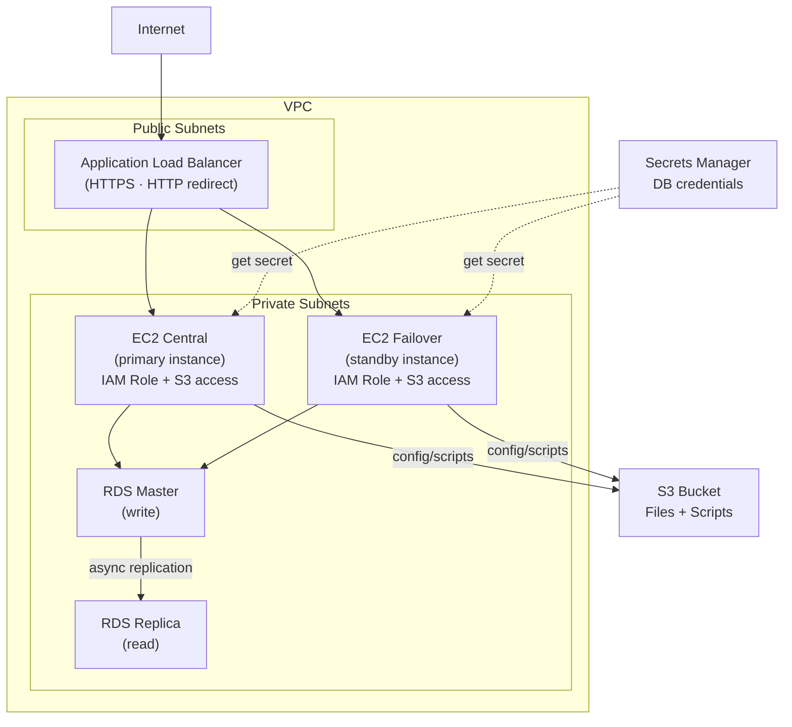

# EC2, ALB, and RDS Terraform Examples

Terraform and Terragrunt examples for EC2 with ALB load balancing, RDS master/replica pattern, IAM roles, security groups, and S3 integration. Includes a central/failover EC2 pair for high-availability patterns.

## Architecture



## Repository Structure

```
├── aws-ec2-central/     # Primary EC2 instance + IAM role
├── aws-ec2-failover/    # Failover EC2 instance + IAM role
├── aws-alb/             # Application Load Balancer
├── aws-rds-master/      # RDS master instance
├── aws-rds-replica/     # RDS read replica
├── modules/
│   ├── alb/             # ALB module
│   ├── ec2_instance/    # EC2 instance module
│   ├── sg_security_group/ # Security group module
│   └── db_instance/     # RDS instance module
└── terragrunt.hcl       # Terragrunt root config
```

## Prerequisites

- [Terraform](https://learn.hashicorp.com/tutorials/terraform/install-cli) installed
- [Terragrunt](https://terragrunt.gruntwork.io/docs/getting-started/install/) installed
- [AWS CLI](https://docs.aws.amazon.com/cli/latest/userguide/getting-started-install.html) configured
- Existing VPC with at least 3 subnets across different AZs
- S3 buckets for config files and Terraform remote state
- IAM user with admin permissions
- Key pair for EC2 access

## Variables to Update

Before deploying, update the following in each module's `variables.tf`:

| Variable | Description |
|----------|-------------|
| `vpc_id` | Target VPC ID |
| `subnet_id` | Subnet ID for EC2 placement |
| `ami_id` | AMI ID for EC2 instances |
| `key_name` | EC2 key pair name |
| `region` | AWS region |
| `availability_zone` | AZ for EC2/RDS placement |

## Usage

```shell
aws configure

terragrunt init
terragrunt plan
terragrunt run-all apply --auto-approve
```

To tear down:
```shell
terragrunt run-all destroy --auto-approve
```
